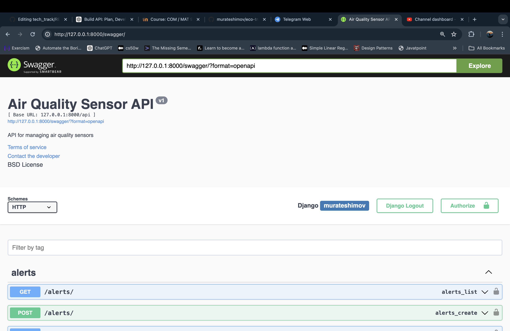
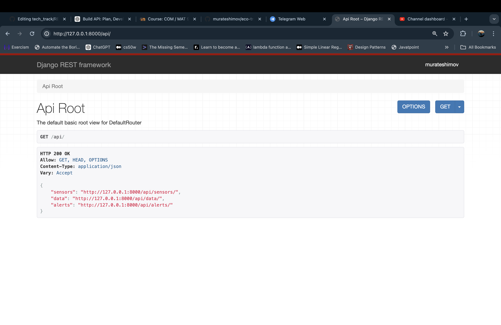

# Eco-Trak Equipment Management API 🛠️

## Project Overview

EcoTrack develops a platform for monitoring and managing environmental data from various sensors and devices. Currently, the company needs a system to manage data on air quality.

## Objectives

The primary goal was to develop an API that allows for robust management of equipment data, including:

- **CRUD Operations**: Create, Read, Update, and Delete functionalities for equipment data.
- **User Management**: Handling user interactions with the API through authentication and authorization.
- **Data Integrity and Performance**: Ensuring high data availability and consistency across simultaneous client requests.

## Key Features

- **Authentication** 🔑: Implemented token-based authentication to secure the API and ensure that only authorized users can access specific functionalities.
- **API Documentation** 📄: Utilized `drf-yasg` for generating live interactive API documentation using Swagger UI.
- **Error Handling** ⚠️: Developed comprehensive error handling to manage and respond to various error states gracefully.

## Technologies Used

- **Django and Django REST Framework**: For building the API and handling the web server.
- **SQLite**: Default database for development, with easy scaling options available for production.
- **Swagger (drf-yasg)**: For API documentation and interactive exploration of API endpoints.

## API Documentation

Access the API documentation and interact with the available endpoints through these interfaces:

- **Swagger UI**: [Swagger Documentation](http://127.0.0.1:8000/swagger/)
- **Redoc**: [Redoc Documentation](http://127.0.0.1:8000/redoc/)

## Screenshots

Here are some visuals of the API in action:

_Swagger UI showing the interactive API documentation._

_Sample output from the Equipment List endpoint._

## Demonstration Video

Watch a full demonstration of the API and its features:

[![EcoTrack API Demonstration]](https://youtu.be/dDjWGRyKwQY)

---

For more information and updates, follow the project repository and keep track of the latest developments.
